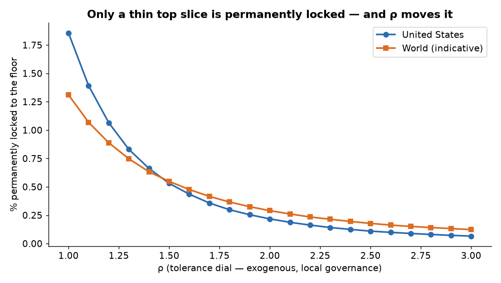
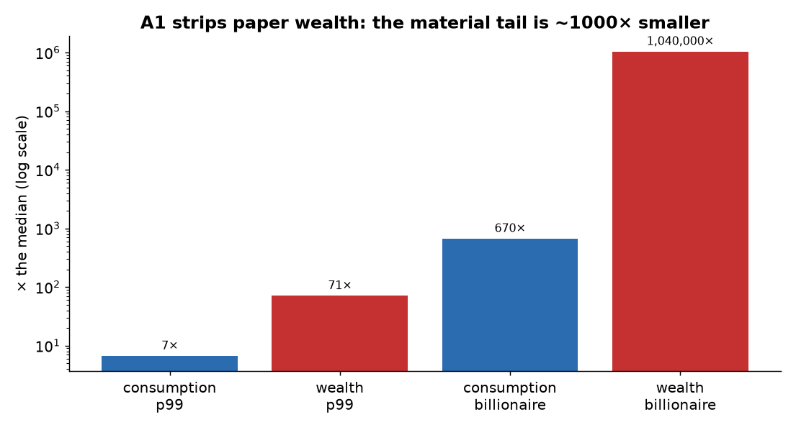
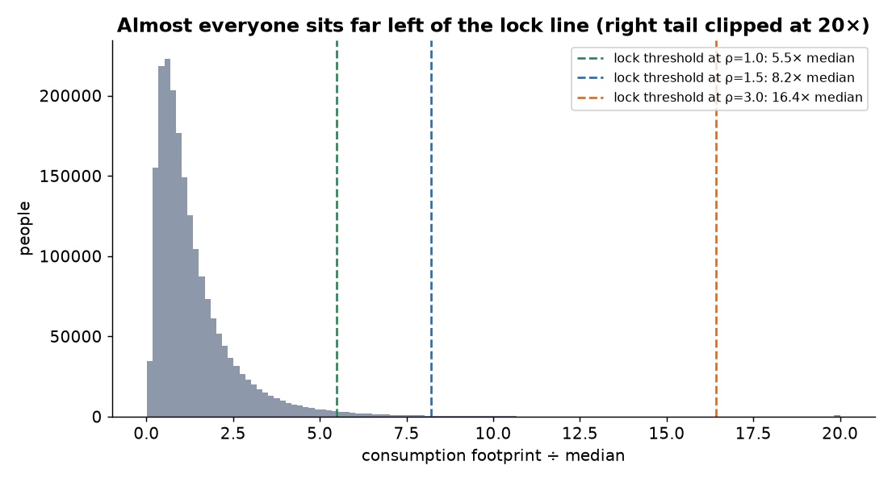

# Who Is Already Past the Ledger? — Q4 (plain-language companion)

> Companion to [`q4_locked_ledgers.py`](q4_locked_ledgers.py). Second sim of the [scenario suite](scenario_suite_METHOD.md).
> **Question:** if everyone were entered honestly into Aequitas, what fraction already sit past the point of a *permanent* ledger lockout?

## The one-line answer

**Once you strip out paper wealth — which Aequitas doesn't count — only about 0.1–2% of Americans are permanently locked out, and it's the *ultra-consumers*, not the merely rich. Their edge was never physical; it was financial, and financial assets aren't material. Meanwhile ~two-thirds of people would *gain* room by joining.**

## First, the correction that makes the question answerable

Your instinct — "billionaires could never get their accounts positive again" — is right, but "positive" needs the axiom-correct meaning. Under §3.5 **aggregate debit always exceeds credit, for everyone, forever** (it's the second law of thermodynamics in the ledger). So "debit > credit" can't be the test — that's all of us.

The real test is the **OP-4 discretionary gate over a lifetime**: you may run discretionary consumption up to `ρ × your credit`. Credit is *time*, and nobody earns faster than **24 h/day** (IC-7). So the most discretionary consumption anyone can *ever* sustain is:

> **T(ρ) = ρ × 24 h/day × 365 = ρ × 8,760 embodied labour-hours per year.**

Consume above that line, forever, and no amount of work or divestment closes the gap — you're **locked to the basic-needs floor for life** (nobody starves; you just get zero discretionary room). That's the honest meaning of "permanently underwater."

**One elegant consequence:** T is anchored to the universal 24-hour day, so it's the *same absolute number of hours everywhere on Earth* — independent of the local floor or network. That's the only reason a world comparison is even meaningful.

## The result

**Material-only (per A1 — stocks, bonds, crypto, options excluded), and giving the wealthy the best case (assume they divest all material property):**

| ρ | US % locked | World % locked |
|---|---|---|
| 1.0 | 1.86% | 1.32% |
| 1.5 | 0.54% | 0.55% |
| 2.0 | 0.22% | 0.29% |
| 3.0 | 0.07% | 0.12% |

The median American (1,600 h/yr) sits **5.5× below** the lock line even at the tightest ρ. To be locked you must consume **>8× the median, continuously, for life** — private-jet-and-superyacht territory.

## Why divesting doesn't save them (your exact scenario)

Selling all their material property removes the *dischargeable material* component of property debit — but **not** their permanent consumption debit (§3.2, a lifetime of jets/yachts/estates never discharges), and it only slowly dilutes the holding-time creation-cost share (§4.5). We modelled on consumption footprint *alone*, which is the most generous possible test. Property residue only makes the lock tighter. So: **yes — even fully divested, the ultra-consumer's lifetime is permanently locked.** The model just shows how thin that group is.

## The A1 result: paper → material tail compression

This is the deep finding. Financial wealth isn't material, so it never enters the ledger — and physical consumption is bounded by time and biology in a way money isn't:

| | p99 / median | billionaire / median |
|---|---|---|
| **Wealth** (SCF/Forbes) | 71× | ~1,040,000× |
| **Material consumption** (WID/Oxfam) | 6.7× | ~670× |

**Stripping paper collapses the tail ~1,000×** (10⁶× → 10³×). The billionaire's million-fold lead over the median was almost entirely paper. What's left — the jets, yachts, and estates — is "only" a few hundred times the median, because you can only physically consume so much in a 24-hour day.

## And most people *gain*

**66% of Americans (73% worldwide) sit below the mean footprint.** Joining replaces their cohort-average *estimate* with their real, lower record (§4.8) — so for two-thirds of people, honest entry *opens* discretionary room. The lock is a ceiling on a thin elite, not a threat to ordinary people.

## Honesty ledger

- **Consumption inequality is modelled from carbon-footprint inequality** (WID/Oxfam) as the best-measured proxy for material throughput. Carbon ≠ embodied-hours exactly; the *structure* (thin tail, ρ-dependence, compression) is robust, the exact % is ±.
- **World results are indicative** — global footprint data is coarse; the US figures are firmer.
- **ρ is exogenous** (local governance, §3.5/A8). We report the % *as a curve over ρ*, never a single number.
- **The lock is a flow/rate test.** A fuller version would track accumulated lifetime debit vs remaining-life max credit (age-dependent); the rate test captures the essence — a consumption rate above ρ×max-earn-rate can never be recovered.
- **"Locked" ≠ destitute.** It means zero discretionary consumption above the always-covered basic-needs floor (§5.5).

## Sources

- Median US adult footprint ~1,600 h/yr — [`median_lifestyle_RESULTS.md`](../median-lifestyle/median_lifestyle_RESULTS.md) (this project).
- Carbon-footprint inequality — [World Inequality Report 2022, ch. 6 (Chancel)](https://wir2022.wid.world/chapter-6/); [WID carbon inequality](https://wid.world/news-article/climate-change-the-global-inequality-of-carbon-emissions/).
- Billionaire personal footprints (jets+yachts, excl. investments) — [Oxfam 2024](https://www.oxfam.org/en/press-releases/billionaires-emit-more-carbon-pollution-90-minutes-average-person-does-lifetime); [Oxfam superyachts & jets](https://www.oxfam.org.uk/get-involved/campaign-with-oxfam/the-environmental-impact-of-superyacht-and-private-jet-emissions/).
- Wealth tail — SCF 2022 / Forbes, via [`disparity_ceiling_sim.py`](../disparity-ceiling/disparity_ceiling_sim.py).

*Tracks Foundations v0.11 §3.5 / OP-4 / A1 / §4.8. Extends the disparity-ceiling result.*
