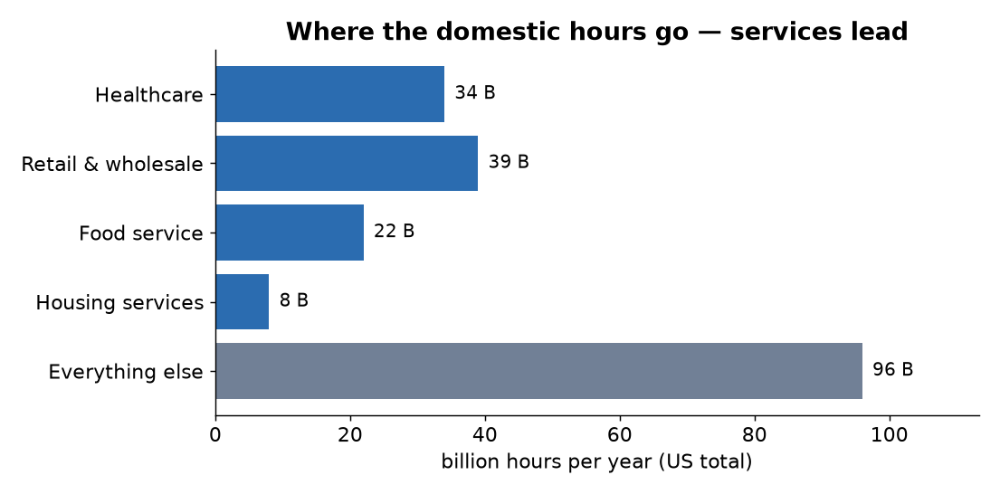
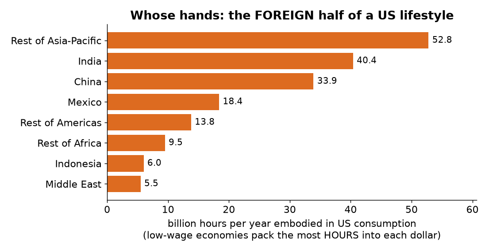

# What Does a Normal American Life Cost — in Hours of Human Work?

*A plain-language walkthrough. No economics background needed.*

**This is the rigorous, bottom-up version.** An earlier top-down attempt (~470–750 hours) was thrown out — it *assumed* where labour goes, missed the work frozen into durable things like houses, and ignored the labour done overseas. This rebuild fixes all three, using measured supply chains and real trade data.

**Companion to:** the calculation scripts `track1_labour.py` … `track4_pollution.py`, the running-numbers log [`median_lifestyle_RESULTS.md`](median_lifestyle_RESULTS.md), and the charts in [`median_lifestyle_v2_charts.py`](median_lifestyle_v2_charts.py). Part of the disparity-ceiling proof (the anchor that says where a real lifestyle sits).

---

## The question

Aequitas measures the cost of things in **hours of human work**, not dollars — because an hour of a person's life means the same thing everywhere, and a dollar doesn't. So: if you added up *all* the human work that goes into a typical American's food, home, clothes, gadgets, travel, healthcare, and everything else in a year — **how many hours is it?**

---

## The short answer

> **A median US adult's lifestyle commands about 1,600 hours of human labour per year — roughly 0.9 of one person's full-time work-year — and about half of it is performed abroad.**

Four separate streams of work add up to that total. Here's each one, in plain terms.

---

## Why hours, not dollars?

A price mixes two things you can never un-mix: how much something *took* to make, and how much people happen to *want* it. An **hour of work** is a physical fact — a loaf of bread took so many person-hours to grow, mill, bake, and deliver, whether or not bread is fashionable. Hours are **equal** (everyone has 24 a day), **honest** (they can't be marked up), and **universal** (an hour means the same in every country). So "what does a lifestyle cost" gets a real, physical answer.

---

## How we built it — four streams of work

### Track 1 — the everyday supply chain (772 hours)

Everything a person buys in a year — groceries, electricity, a haircut, a doctor's visit, a bus ticket — sits on top of a chain of work: the farmer, the trucker, the checkout clerk, the nurse, and everyone who supplied *them*. We measured that whole chain.

- **What people spend, by category:** the US government's [Consumer Expenditure Survey](https://www.bls.gov/cex/).
- **How much work hides behind each dollar of spending:** the [BLS Employment Requirements Matrix](https://www.bls.gov/emp/data/emp-requirements.htm) — a table, built from the national accounts, that says how many jobs (direct *and* all the way down the supply chain) stand behind $1 million of demand for each kind of product. It ranges from **0.7 jobs** per million dollars of gasoline (a few people run a very automated refinery) to **18 jobs** for a school.

The hours cluster in **labour-intensive services** — hospitals, shops, restaurants — not in factories. That's the first surprise: making *stuff* takes less human time than looking after *people*.

### Track 2 — the house you're standing in (45 hours)

Your home was built years ago, so its construction never shows up in this year's spending — but you use it every day. Under Aequitas that build-labour is spread evenly over the home's life (the way the cost of a durable thing is shared out over the years you hold it). A typical home takes about **3,200 hours to build** (≈1.8 person-years, counting the lumber, concrete, steel, and wiring all the way back). Spread over a 60-year life, plus ongoing repairs, that's **45 hours a year** per adult — real work that the everyday-spending numbers can't see.

### Track 3 — the half that happens overseas (785 hours)

Here's the big one. The Track 1 table only counts work done *inside the US*. But your phone, your clothes, and much of your furniture were made abroad. To count that foreign labour we used **[EXIOBASE](https://www.exiobase.eu/)**, a global model that tracks who works for whom across 49 regions of the world economy, including the *hours* they work.

The result: **785 hours a year of foreign labour** — almost exactly as much as the entire domestic total. A median lifestyle is **about half homemade, half imported labour**.

Notice **India and the rest of low-wage Asia**, not just China. This is the key thing a simpler estimate gets wrong: in *hours*, the poorest exporters count for the most, because when wages are very low, a single dollar of imports buys a great many hours of someone's time. Only a country-by-country model can see that — and it's why our first quick guess (about 350 hours) was less than half the real figure.

### Track 4 — cleaning up your own mess (about 26 hours)

Finally, the work of dealing with the pollution *you personally* cause — the fuel you burn in your car and furnace, the electricity you draw (whose generation fires up a power plant the instant you flip the switch), and your wastewater. Turned into the labour needed to capture that carbon and treat that water, it comes to a modest **6–29 hours a year** (the range is whether carbon is captured cheaply by planting trees or expensively by machines — and, interestingly, the machine route takes *fewer* human hours per tonne, because its cost is mostly electricity and steel, not people). Small next to the rest — but real, and it's the part most accounting ignores entirely.

---

## Why you can trust the number

The single best check: **two completely independent datasets agree.** The domestic labour came out to **772 hours** per adult using US government supply-chain tables (Track 1), and **872 hours** using the entirely separate global EXIOBASE model (Track 3's domestic half) — within about 13% of each other, from different countries' statisticians using different methods. When two independent roads lead to nearly the same place, the place is probably real.

---

## Honest caveats

- **~1,600 is a mean-ish figure; the true median adult is a bit lower** (~1,350), because a few big spenders pull the average up. We used a rough 0.83 haircut for that, flagged for refinement.
- **The overseas number, though solid, uses 2022 data** (the latest the global model offers) against 2023 for everything else — a one-year mismatch.
- **The pollution range is wide** on purpose — nobody yet knows the true cost of pulling carbon back out of the air.
- **These are order-of-magnitude-solid, not accountant-exact.** The point is the *scale* and the *shares*: about a person-year of work, roughly half of it foreign, dominated by services and care.

---

## Average vs. typical — and why the average can't go global

So far we've followed one *adult*. Now let's count *every* person (children included, dividing each household by its 2.51 people) and ask two questions: how does the **typical** person (the median) compare to the **average** person — and could everyone on Earth live that way?

The average is what you'd get **if all consumption were shared out evenly** — it's pulled up by the wealthy. You might expect a big gap. There isn't one:

**The average lifestyle is only ~1.2× the typical one.** Compare that to *income*, where the top runs tens of thousands of times the middle. Why the difference? **You can't eat 1,000× the food or live in 1,000× the house.** Consumption is physically self-limiting in a way money isn't — which is the whole disparity-ceiling idea, showing up in real data before Aequitas changes a single rule. Wealth and income run away; *lifestyle* doesn't.

**But could everyone have the average American lifestyle?** No — and precisely *why* is the interesting part:

- **Labour: about 1.5× short**, but that's the *soft* limit — the world's workers get more productive every year, so this gap closes with time. Not the real wall.
- **Resources: a hard physical wall.** Universalised, the average American footprint needs **1.5× the world's materials, ~2.7× a safe carbon budget, and 3.7× the planet's farmable land** — the land footprint alone (2.2 hectares each × 8 billion people) is *larger than every continent combined*. This is the familiar "we'd need several Earths" result, and it doesn't yield to productivity: there is only so much land and only so much sky.

**Here's the punchline for Aequitas.** Today's dollar accounting *hides* this — by GDP, the American lifestyle looks like pure success. Aequitas can't hide it: the land debt, the carbon debt, and the material debt each land on someone's ledger and never cancel out. **The unsustainability that prices delete, honest cost-accounting is forced to show.**

---

## What it means

This isn't just trivia. Aequitas claims it can cap the gap between the richest and poorest lifestyles at a small multiple — and to make that claim credibly, you have to know **where a normal lifestyle actually sits.** Now we do: a median adult's lifestyle rests on **about 1,600 hours of other people's lives every year, half of them in countries most of us never think about** — and the *average* lifestyle, though only slightly larger, turns out to be one the planet physically cannot extend to everyone. That's the anchor the rest of the argument is measured against.

---

## Where the numbers come from

- Spending by category — [US BLS Consumer Expenditure Survey](https://www.bls.gov/cex/)
- Labour behind each dollar (domestic) — [BLS Employment Requirements Matrix](https://www.bls.gov/emp/data/emp-requirements.htm) *(note: BLS temporarily withdrew these tables in Feb 2026 to fix an error; we used the last good published version)*
- Consumer spending in producer values (the retail/transport split) — [BLS Input-Output accounts](https://www.bls.gov/emp/data/input-output-matrix.htm)
- Foreign labour in world trade — [EXIOBASE 3 global model](https://www.exiobase.eu/)
- Import share of US spending — [Federal Reserve Bank of San Francisco](https://www.frbsf.org/research-and-insights/publications/economic-letter/2011/08/us-made-in-china/)
- Foreign wages — [Conference Board / BLS International Labor Comparisons](https://www.bls.gov/fls/flshcpwindnaics.htm)
- Household emissions — [EPA vehicle emissions](https://www.epa.gov/greenvehicles/greenhouse-gas-emissions-typical-passenger-vehicle) · [EIA energy use](https://www.eia.gov/energyexplained/us-energy-facts/)

*Full method: [`median_lifestyle_METHOD.md`](median_lifestyle_METHOD.md). Every number with its calculation: [`median_lifestyle_RESULTS.md`](median_lifestyle_RESULTS.md).*
